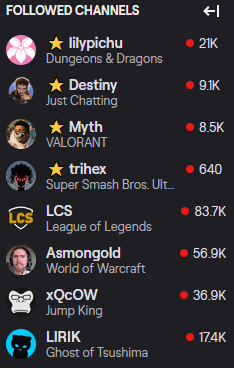

# Twitch Pin Favorites
Pin your favorite Twitch channels to the top of the navigation bar so you can easily see when they're live.

This bypasses the default order sorted by viewcount so your favorite smaller channels can appear near the top.

## Install

Firefox

In review

## Usage

Go to the add-on's options page and enter in the channel names, then refresh Twitch.

`ctlr-shift-a` -> Twitch Pin Favorites -> Options

## Develop

Go to `about:debugging#/runtime/this-firefox` and load as temporary add-on.

## Todo

- [x] Reduce cpu cycles
- [ ] Style options page
- [ ] Allow import/export list of channel names
- [ ] Port to Chrome
